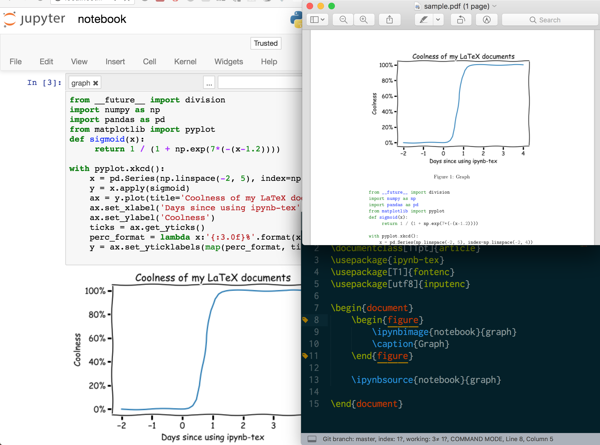
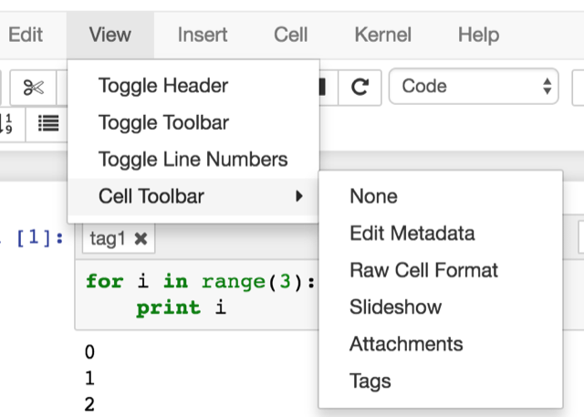
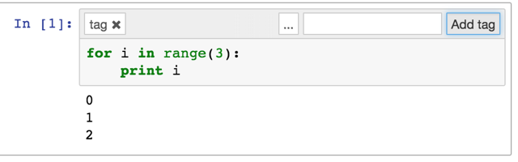

# ipynb-tex.sty 

ipynb-tex is a simple style sheet which allows you to extract tagged cells out of a Jupyter notebook and include them in a TeX document

Rather than save output or copies of source code to insert into TeX docs, ipynb-tex always inserts the latest cells from your notebooks directly into TeX files.

### Installation
In your main document directory, just make a symlink to the ipynb-tex.sty file.

    ln -s /path/to/ipynb-tex/ipynb-tex.sty

### Include cells in your .tex document

| Command                           | Description                                                                                                                 |
|--------------------------------------------------------------|---------------------------------------------------------------------------------------------------------------------|
| `\ipynbsource{notebook}[tag]` | Include the source from all cells sharing the tag "example".                                                                |
| `\ipynboutput{notebook}[tag]` | Include the output from all cells sharing the tag "example".                                                                |
| `\ipynb{notebook}[tag]`       | Include the source and output from all cells sharing the tag "example".                                                     |
| `\ipynbimage{notebook}[tag]` | Include an image |
| `\ipynbtex{notebook}[tag]` | Include raw TeX output |

### Compile LaTeX
ipynb-tex uses PythonTeX to execute the cell extraction code. So, just as with PythonTeX, you'll need to execute `pythontex` as part of your document build. Also include --shell-escape to allow external functions to be called correctly.

    pdflatex --shell-escape document.tex    #scan the document, figure out what Python needs to be executed
    pythontex --rerun=always document       #executes the Python found in the document
    pdflatex --shell-escape document.tex    #include any valid TeX printed from the Python execution
    pdflatex --shell-escape document.tex    #ensure any included references are correctly handled

### Tagging cells in a notebook

Toggle the toolbar UI

Tag a cell

### Modifying this plugin
This repo comes with a ready to go version of `ipynb-tex.sty`, but if you want to make changes and rebuild it just run `./build`, which merges `ipynb-tex-template.sty` and `extract_cells.py` to create `ipynb-tex.sty`.

There are no package dependencies required to run this script, but to execute the sample you'll need to include a set of dependencies.

    pip install -r requirements.txt

### Running Tests

    pip install nose
    nosetests

### Todo 
- Remove the need to "rerun=always", by registering the [filename].ipynb as a dependency while pythontex is running.
- Export cells only once, by making an in-memory variable which tags a file as already processed, to avoid repeated work.
- Add a \ipynbdirectory which serves as the base path for all notebooks, so if you're compiling a doc with lots, no need to keep including the path

